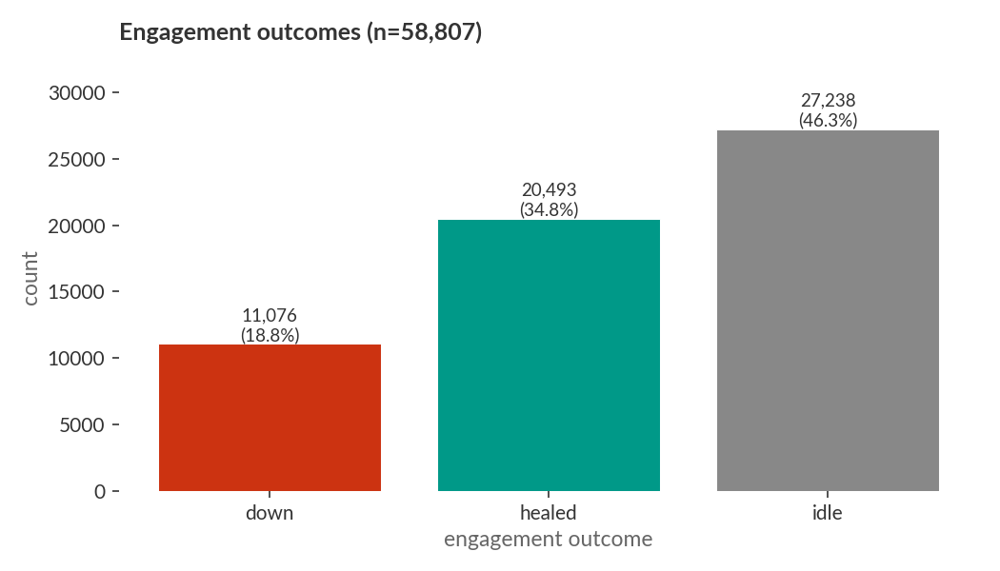
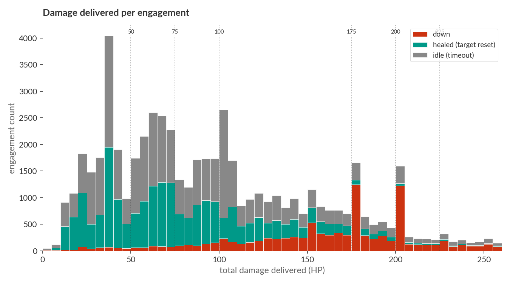
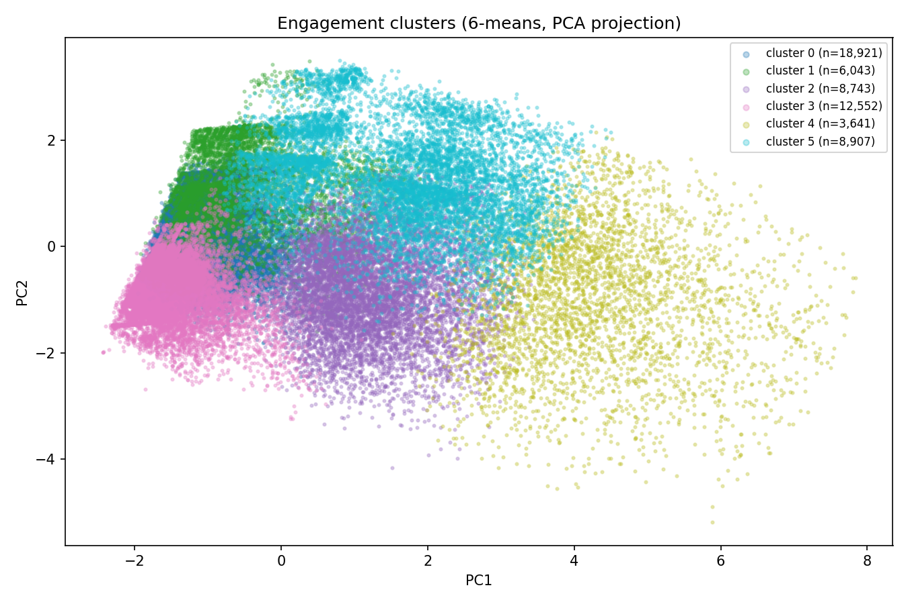
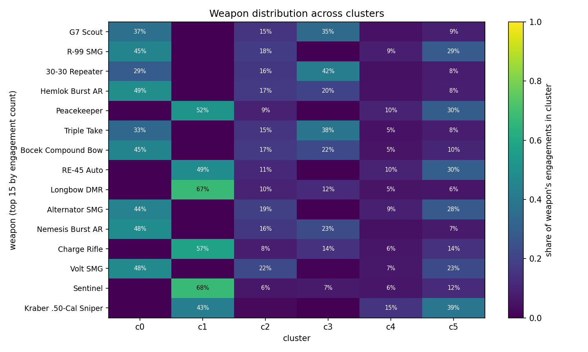
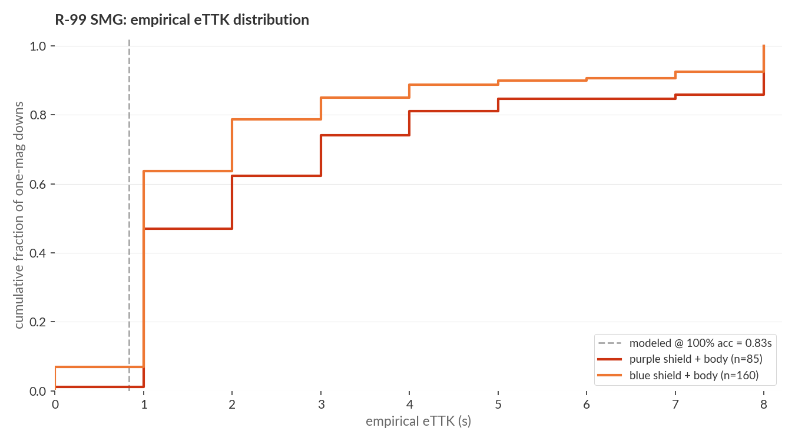
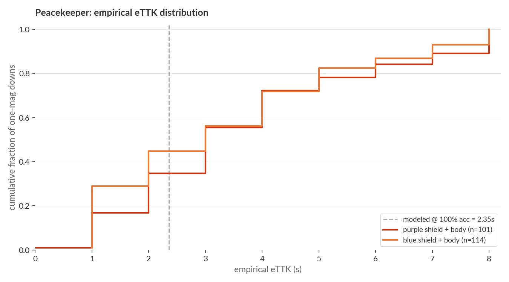
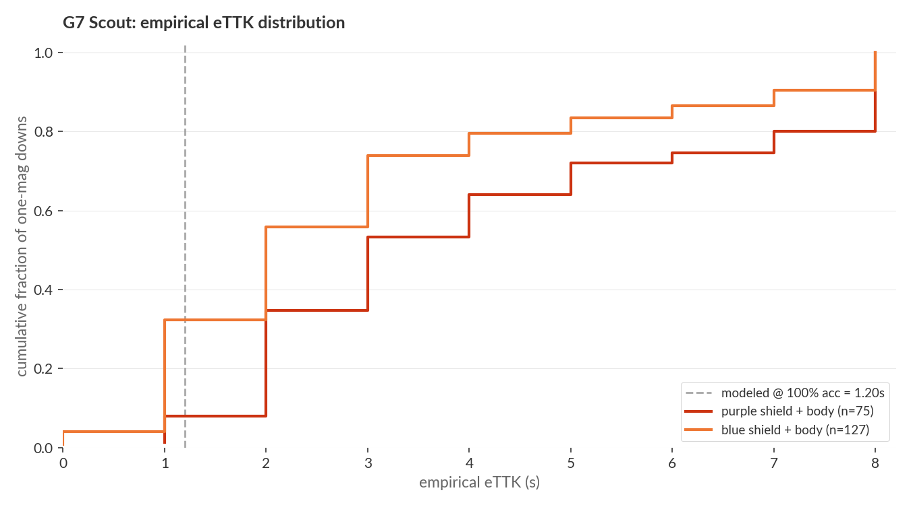

# What pro Apex engagements actually look like

Most weapon-balance arguments start from theoretical TTK: damage times rate of fire against a 200 HP target. That number describes a single thing well. It describes nothing else. Pro Apex isn't a series of clean 1v1 duels at perfect accuracy. The interesting question is what fraction of engagements look like the model assumes, and what the rest look like.

This post answers that with 137,620 engagement records reconstructed from ALGS damage events, downs, and heals (1,576 games across Y3 to Y6). The analysis below uses the 58,807 engagements since 2025-02-10, the post-S24 patch regime where R-99 sits at 13 damage.

## What counts as an engagement

An engagement is one continuous window of damage on a single victim. It opens on the first damage tick and closes on whichever happens first: the victim is downed, the victim heals back to their max HP, or 30 seconds pass without further damage. Multiple attackers are merged into one engagement record with a contributors array, so a 1v3 spike is a single row, not three.

The state-based definition was chosen over a fixed time window after a sweep across T = 2, 3, 5, 8, 10, 15, 20 seconds: time-based windows either split a single coordinated focus-fire into multiple short engagements (small T) or stitched independent fights into one (large T). HP-out-of-max with an idle timeout matched the events that players would describe as one fight roughly 90% of the time.

## The headline numbers

Of those 58,807 engagements:

- **18.8% ended in a down.** Less than one in five.
- **34.8% ended with the victim healing back to full.** Damage delivered, no kill, the target reset.
- **46.3% ended idle.** No follow-up within 30 seconds, victim survived without fully healing.

The median engagement delivers **88 HP** in **6 seconds** at **33% accuracy**. The top attacker dealt the killing blow alone in only the high-share end of the distribution: **33.8% of engagements involve at least two attackers**.

The damage histogram has a visible mode below 100 HP (chip damage) and a second around 200 HP (one-shield kills). Most engagements never reach the threshold the TTK model assumes the player is aiming for.

## Six archetypes

KMeans (k=6) on standardized engagement features (duration, total damage, n_attackers, top-attacker share, range, weapon class, downed, accuracy) splits the 58,807 engagements into six recognizable archetypes:

| cluster | size | outcome | duration | range | n_attackers | accuracy | dominant weapons | what it is |
|---|---|---|---|---|---|---|---|---|
| C0 | 32% | 54% idle, 46% healed | 6s | 50m | 1.0 | 40% | G7, R-99, Hemlok | mid-range solo chip |
| C3 | 21% | 53% idle, 46% healed | 6s | 144m | 1.0 | 49% | G7, 30-30, Triple Take | long-range solo poke |
| C5 | 15% | 100% down | 6s | 35m | 1.8 | 56% | R-99, G7, Peacekeeper | close-range, down with light teammate help |
| C2 | 15% | 62% idle, 38% healed | 15s | 64m | 2.2 | 47% | G7, R-99, 30-30 | sustained focus-fire that didn't kill |
| C1 | 10% | 59% idle, 37% healed | 6s | 44m | 1.2 | 72% | Peacekeeper, Longbow, RE-45 | high-accuracy short burst |
| C4 | 6% | 45% down, 40% idle, 15% healed | 35s | 47m | 3.4 | 51% | G7, R-99, Peacekeeper | protracted team push |

Two clusters carry almost all of the kills. **C5 (15%) ends in a down 100% of the time. C4 (6%) ends in a down 45% of the time.** Together they cover roughly 95% of all downs in the dataset. Everything else (chip, poke, focus-fire that didn't connect) accounts for the other 79% of engagements.

The weapon-cluster heatmap is what makes the long-range marksmen look so different from the close-range SMGs. G7 Scout's engagements split heavily into C0/C2/C3, the chip and poke clusters, with very few in C5. The R-99's split is the opposite: a clear C5 lobe. Same dataset, same 200 HP victims, two different weapons doing two different jobs.

## Where the TTK model lives

The eTTK model assumes one attacker at full commitment delivering 200 HP within one magazine. That description fits **C5**: close-range (35m), short duration (6s), single dominant attacker (top share 0.77, n_attackers 1.8, so usually one shooter with a teammate landing a few rounds), 100% downed. C5 is 15% of engagements.

C4 is the other 6% of downs: 35-second team push, 3.4 attackers, top share 0.50. The model's "one attacker with one magazine" fundamentally doesn't describe these. They are extended team trades where the kill is a side effect of position, not a single-weapon TTK race.

To check whether the model still describes C5 well, here are the empirical purple-shield (190-220 HP) one-mag medians compared to the modeled values:

| weapon | empirical median | modeled at 100% acc | modeled at observed acc | observed median acc |
|---|---|---|---|---|
| R-99 SMG | 1.0s | 0.83s | 1.28s | 67% |
| Peacekeeper | 3.0s | 2.35s | 3.53s | 100% |
| G7 Scout | 3.0s | 1.20s | 3.12s | 46% |
| 30-30 Repeater | 3.0s | 1.73s | 2.16s | 100% |

R-99 lands within rounding of its modeled value (data is integer-second precision). Peacekeeper, G7, and 30-30 are slower than full-accuracy modeled but close to the modeled-at-observed-accuracy column. The model is doing what it claims to do: predict TTK as a function of accuracy.

What the model can't do is tell you how often a fight looks like C5 in the first place. A weapon's empirical kill conversion is shaped at least as much by the cluster mix it sees as by its TTK floor.

## What this changes about weapon balance arguments

The implications stack:

- **Theoretical TTK describes 15% of pro engagements** (C5). If the argument for or against a weapon is "its TTK is X seconds," it's an argument about that 15%. Healing and idle outcomes are 81% of engagements and have nothing to do with TTK.
- **Range bandwidth is its own axis.** G7 Scout dominates C0+C2+C3 (the 50m-144m chip and poke clusters) because it works across that range, not because its TTK is fastest. A weapon's "feel" includes the range bands it can credibly threaten in, not just its 200 HP race time.
- **Multi-attacker engagements are roughly half the kills.** C4 and the multi-attacker tail of C5 mean most pro kills involve a teammate landing at least some damage. Weapons that finish solo trades cleanly (high `solo_down_share`) and weapons that contribute to focus-fire are doing different jobs; ranking them on the same TTK axis flattens that distinction.
- **The healed cluster is signal, not noise.** A healed engagement is one where the victim absorbed real damage and stayed alive. Pros tank a lot. Chip damage isn't a missed kill, it's the medium pro fights happen in.

## Methodology in one paragraph

Damage events come from ALGS scrim and tournament tick logs (`data/tournament_damage_events`). Down events are extracted from the `playerDowned` HTML in per-game pkls. Heal events are extracted from `inventoryUse` events with HP-restore amounts mapped per item (Shield Cell +25, Shield Battery +100, Syringe +25, Med Kit +100, Phoenix Kit full). The engagement walker is a state machine on per-victim event streams: starts on damage, accumulates contributors, closes on down / full-heal / 30s idle. Each engagement carries the full contributor list as JSON for multi-attacker analysis plus single-attacker derived columns for the simple slice. KMeans clustering uses scipy with std-whitened features and k=6; the cluster labels above are post-hoc human readings of centroid signatures.

The full pipeline is at [`src/build_kill_records.py`](../../../src/build_kill_records.py), [`src/analyze_engagement_landscape.py`](../../../src/analyze_engagement_landscape.py), [`src/cluster_engagements.py`](../../../src/cluster_engagements.py), and [`src/analyze_empirical_ttk.py`](../../../src/analyze_empirical_ttk.py). Outputs in [`output/engagement_landscape.md`](../../../output/engagement_landscape.md), [`output/engagement_clusters.md`](../../../output/engagement_clusters.md), and [`output/empirical_ttk_summary.md`](../../../output/empirical_ttk_summary.md).
