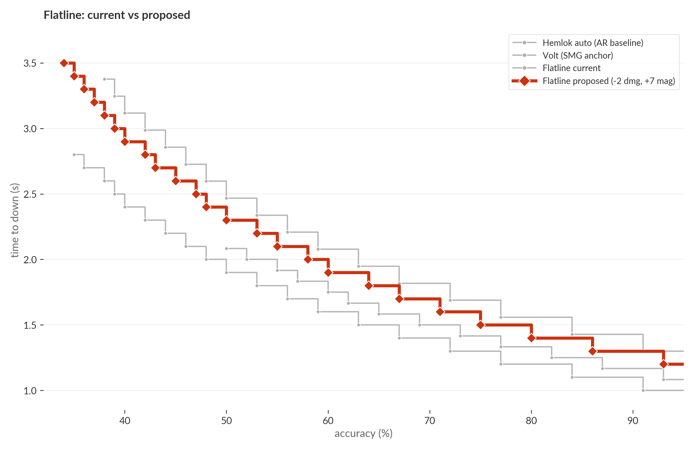
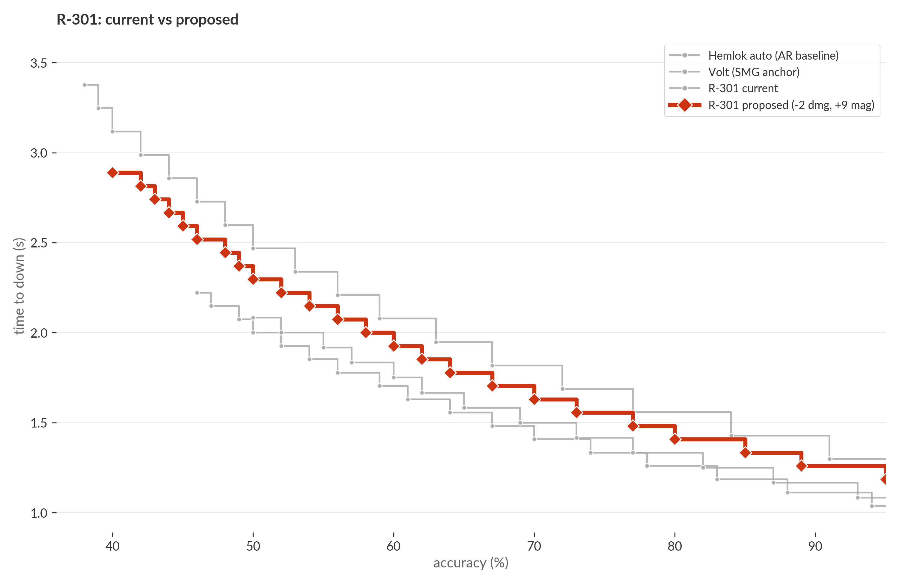
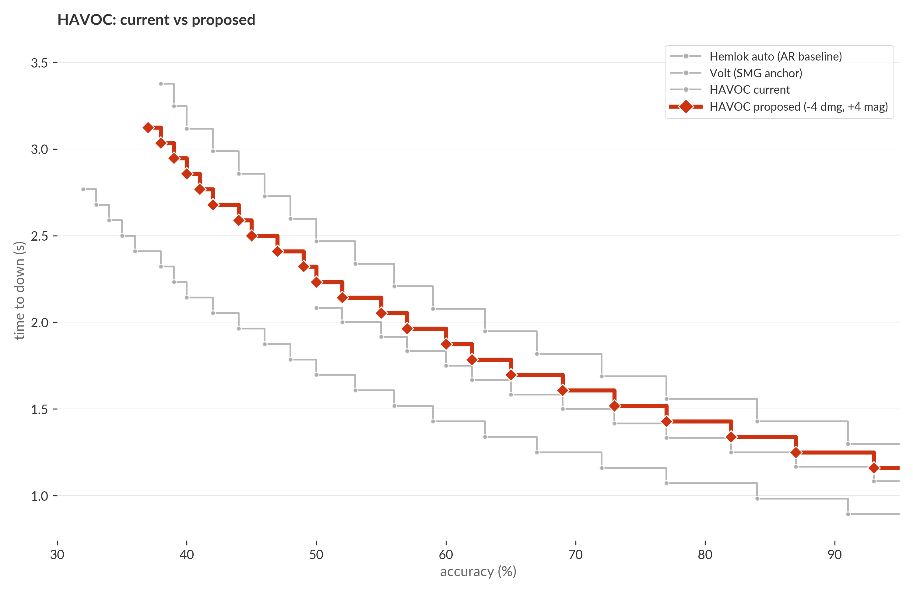
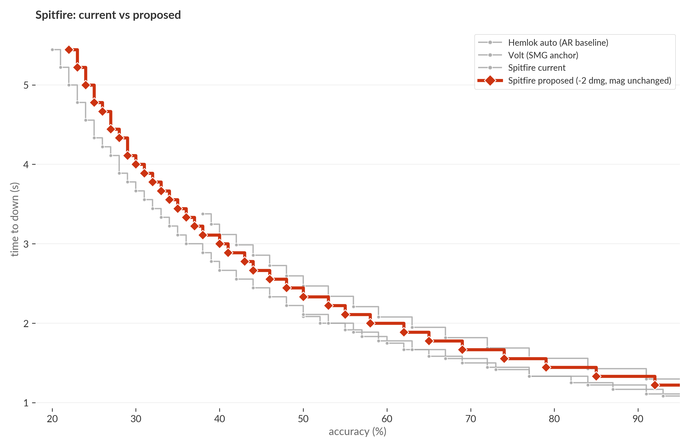
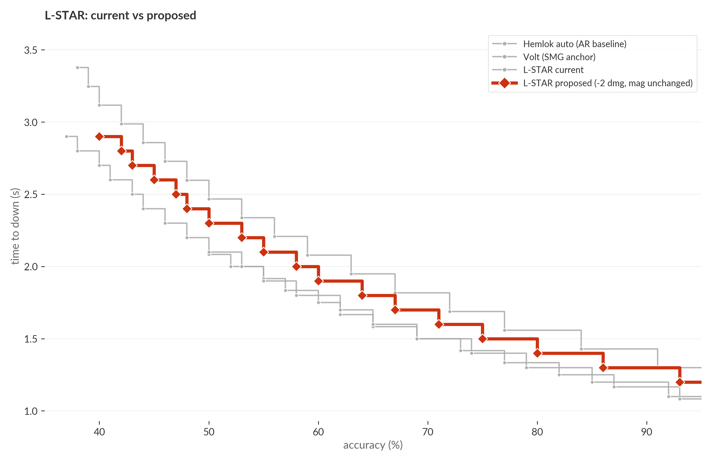
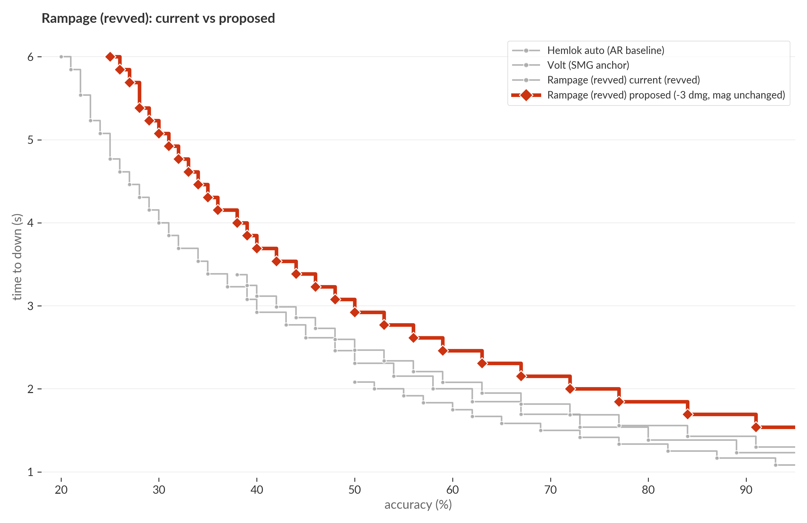
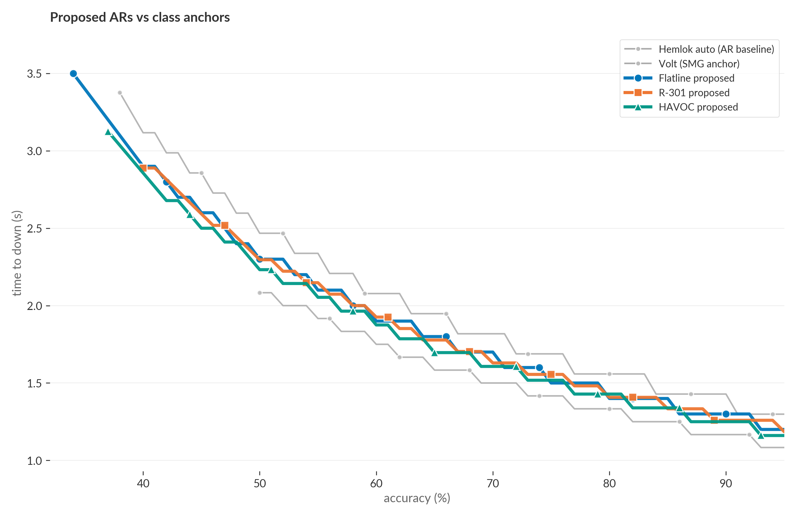
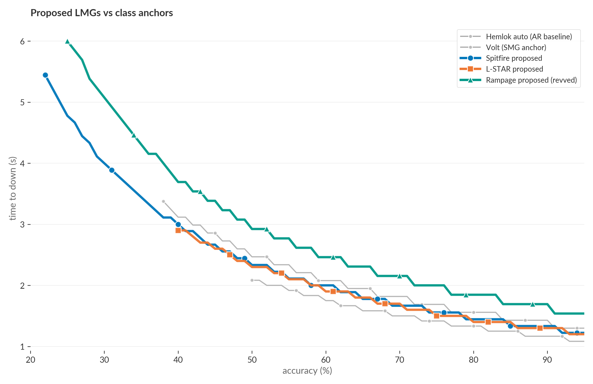

# Long-range autos: every weapon faster than Hemlok, by class

Hemlok auto downs a purple-shielded target in **1.17 seconds** at full accuracy [(#hemlok-down)](#hemlok-down). Every other long-range automatic is faster: HAVOC 0.80s, Spitfire 0.89s, Flatline 0.90s, R-301 0.96s, L-STAR 1.00s [(#current-tdowns)](#current-tdowns). The class baseline is the slowest weapon in the class.

This post walks through each long-range auto in turn, anchored against Hemlok (the AR baseline) and Volt (an SMG anchor for cross-class context). The proposed change in every case is paired: cut per-bullet damage, add magazine, hold total per-mag damage roughly flat. Same logic as [post 1: R-99 paired -2 dmg / +5 mag](../r99_nerf/post.md), applied class-wide.

## VK-47 Flatline: 20/29 → 18/36



Flatline currently downs in 0.90s [(#flatline-current)](#flatline-current) — between R-99 (0.83s) and Volt (1.00s). At 600 RPM with a tight horizontal recoil pattern, it's the SMG that calls itself an AR.

Proposed 18/36 lifts t_down to 1.10s [(#flatline-proposed)](#flatline-proposed) and bumps mag from 29 to 36. Per-mag damage moves from 580 to 648 (+12%). Minimum accuracy to one-clip drops from 35% to 33%. The +7 mag earns the close-range nerf back as long-range sustain — more rounds in the air per engagement, smaller per-shot punish, same recoil profile.

## R-301 Carbine: 15/31 → 13/40



R-301 currently downs in 0.96s [(#r301-current)](#r301-current). The lowest-recoil AR in the game; pros pick it for sustained ranged trades. The problem is that it's also fast enough at close range to win straight-up against SMGs.

Proposed 13/40 lifts t_down to 1.11s [(#r301-proposed)](#r301-proposed). Per-mag damage moves from 465 to 520 (+12%), a_down from 45% to 40%. The +9 mag is the largest single floor-loot mag in Apex history, and that's the point: R-301 should be the long-range beam, not the close-range trade. Mag depth is the lever that earns the identity.

## HAVOC Rifle: 20/32 → 16/36



HAVOC's pure firing time is **0.80s** [(#havoc-current)](#havoc-current) — the fastest long-range weapon in the game. The 0.42-second pre-fire charge [(#havoc-charge)](#havoc-charge) makes the *first* shot of an engagement slower, but the charge is paid once and forgotten; sustained engagements run at the 0.80s number.

Proposed 16/36 brings sustained t_down to 1.07s [(#havoc-proposed)](#havoc-proposed). Per-mag damage moves from 640 to 576 (a 10% cut, the only weapon in this rebalance that loses total per-mag damage). a_down moves from 31% to 36%. The charge stays as HAVOC's identity cost; the spam-down advantage goes away.

Turbocharger was removed entirely on **2024-09-12** (Space Hunt event); HAVOC has had a mandatory 0.42s charge for ~1.5 years. Subsequent patches adjusted damage (18 → 21 → 20) and recoil but never the charge time itself.

## M600 Spitfire: 21/50 → 19/50



Spitfire downs in 0.89s [(#spitfire-current)](#spitfire-current) with an a_down of just 18% — the 50-round mag is so deep that almost any accuracy one-clips. LMG ergonomic costs (slow ADS, big spread) were the design counterweight, but the close-range t_down crossed into SMG territory.

Proposed 19/50 lifts t_down to 1.11s [(#spitfire-proposed)](#spitfire-proposed) and holds the mag. a_down moves from 18% to 22%. Per-mag damage drops 1050 → 950 (-10%). Spitfire keeps its mag-depth identity — the LMG you use when you don't want to reload — and gives up only its close-range punish.

## L-STAR EMG: 19/30 → 17/30



L-STAR downs in 1.00s [(#lstar-current)](#lstar-current) — already the slowest of the close-range autos but still under Hemlok. The defining feature isn't the magazine; it's the no-reload overheat mechanic, which makes effective sustain far higher than 30 shots over a long engagement.

Proposed 17/30 lifts t_down to 1.10s [(#lstar-proposed)](#lstar-proposed). a_down moves from 37% to 40%. Per-mag damage 570 → 510 (-10%). The "no traditional reload" identity is preserved; only the per-shot punish moves.

## Rampage LMG (revved): 25/40 → 22/40



Rampage's revved state — 30% RPM bonus from a thermite grenade — currently downs in **1.08s** [(#rampage-current)](#rampage-current), faster than every AR and slower only than the SMGs. Unrevved Rampage at 1.40s isn't the problem; the streamer-bait revved combo is.

Proposed 22/40 brings revved t_down to 1.39s [(#rampage-proposed)](#rampage-proposed) and unrevved to 1.80s. The thermite ritual is still rewarded — revved is meaningfully faster than unrevved — but the close-range dominance goes away. a_down moves from 20% to 25%.

## All proposed ARs at once



Three AR proposals (Flatline, R-301, HAVOC) cluster in a 0.05-second band at full accuracy, all between Hemlok (1.17s) and Volt (1.00s). Class identity restored: ARs are the slow-and-steady mid-range tools, slower than SMGs at close, faster only via recoil control over distance.

## All proposed LMGs at once



Spitfire and L-STAR converge with each other and sit just below Hemlok (1.10s and 1.11s). Rampage revved separates upward at 1.39s — the ritual-cost weapon is meant to be slower. LMGs and ARs do not share a chart because their handling profiles (ADS time, spread, hipfire) make t_down a partial story; the t_down convergence is necessary but not sufficient.

## Nemesis: no change

Nemesis ramps from 451 RPM cold to 582 RPM after three bursts. Cold t_down (12 hits, 3 bursts at base rate) is ~1.62s; charged steady-state is ~1.29s [(#nemesis-ramp)](#nemesis-ramp). The ramp itself is the differentiator; charged steady-state already sits above Hemlok. No change recommended in this round.

## Caveats

- **Recoil.** The model is range-flat. "Long-range viability" assumes the player can control recoil — the math shows damage delivered, not bullets that hit a 60m target. Recoil patterns are tuned by Respawn separately.
- **HAVOC charge-up.** The 0.42s pre-fire delay is paid once per engagement. Sustained-fire t_down is what each chart shows; first-shot t_down adds 0.42s.
- **Nemesis ramp-up.** Burst rate ramps from 451 to 582 RPM after the third burst.
- **Rampage thermite.** "Revved" is a temporary state that costs a thermite grenade. Unrevved Rampage at 1.80s is the more common t_down in pro play.
- **L-STAR overheat.** L-STAR has no traditional reload; the 30 "magazine" is shots-before-overheat. Effective sustain over a long engagement is much higher than 30 shots.
- **Numbers are expectation-based.** At exactly the minimum accuracy to one-clip, the kill happens *on average*, not every time.

---

## Methodology

The model is the same as in the [R-99 post](../r99_nerf/post.md): 200 HP target (100 shield + 100 health), one-magazine bound, time-to-down at full accuracy as the headline metric, minimum accuracy to one-clip as the secondary. Hits-to-kill use game-accurate overspill on the shield-breaking bullet (a hit that breaks the shield credits its residual raw damage to health on the same hit). Bullets fired at accuracy `a` is `ceil(hits / a)` — no fractional bullets.

The model does not simulate range falloff, recoil, HAVOC charge-up, Nemesis ramp-up, Rampage revved/unrevved switching (plotted as separate curves), or L-STAR overheat. All five are addressed in the caveats and notes.

## Notes

<a id="hemlok-down">**hemlok-down.**</a> Hemlok auto t_down at full accuracy. **Derived.** Damage 22, magazine 27, RPM 462. Shield: 4 full hits = 88; the 5th hit overspills 10 to health. Health: `ceil(90/22)` = 5. Total hits = 10. Time = `9 * 60 / 462` = 1.169s.

<a id="current-tdowns">**current-tdowns.**</a> Current long-range auto t_downs at full accuracy. **Derived.** All values use the overspill model on a 100-shield + 100-health target. HAVOC (20/32/672): 10 hits, 0.804s pure-fire. Spitfire (21/50/540): 9 hits, 0.889s. Flatline (20/29/600): 10 hits, 0.900s. R-301 (15/31/810): 14 hits, 0.963s. L-STAR (19/30/600): 11 hits, 1.000s. Source: `data/ettk_results.csv`.

<a id="flatline-current">**flatline-current.**</a> Flatline current t_down. **Derived.** Damage 20, magazine 29, RPM 600. Shield: 5 hits = 100 exact, 0 overspill. Health: `ceil(100/20)` = 5. Total hits = 10. Time = `9 * 60 / 600` = 0.900s. a_down = `10 / 29` = 34.5%.

<a id="flatline-proposed">**flatline-proposed.**</a> Flatline proposed t_down. **Derived.** Damage 18, magazine 36. Shield: 5 full hits = 90; the 6th overspills `(18 - 10/1)` = 8 raw to health. Health: `ceil(92/18)` = 6. Total hits = 12. Time = `11 * 60 / 600` = 1.100s. a_down = `12 / 36` = 33.3%.

<a id="r301-current">**r301-current.**</a> R-301 current t_down. **Derived.** Damage 15, magazine 31, RPM 810. Shield: 6 full hits = 90; 7th overspills 5 to health. Health: `ceil(95/15)` = 7. Total hits = 14. Time = `13 * 60 / 810` = 0.963s.

<a id="r301-proposed">**r301-proposed.**</a> R-301 proposed t_down. **Derived.** Damage 13, magazine 40. Shield: 7 full hits = 91; 8th overspills 4 to health. Health: `ceil(96/13)` = 8. Total hits = 16. Time = `15 * 60 / 810` = 1.111s. a_down = `16 / 40` = 40.0%.

<a id="havoc-current">**havoc-current.**</a> HAVOC sustained-fire t_down (excluding 0.42s charge-up). **Derived.** Damage 20, magazine 32, RPM 672. Shield: 5 hits = 100 exact, 0 overspill. Health: `ceil(100/20)` = 5. Total hits = 10. Time = `9 * 60 / 672` = 0.804s.

<a id="havoc-proposed">**havoc-proposed.**</a> HAVOC proposed sustained-fire t_down. **Derived.** Damage 16, magazine 36. Shield: 6 full hits = 96; 7th overspills 12 to health. Health: `ceil(88/16)` = 6. Total hits = 13. Time = `12 * 60 / 672` = 1.072s.

<a id="havoc-charge">**havoc-charge.**</a> HAVOC's mandatory 0.42-second pre-fire delay. **Quote.** From `data/guns_stats.csv` (`charge_time` column). Turbocharger hop-up (which reduced charge_time to 0.01s) was removed on **2024-09-12** (Space Hunt event), per `data/patch_note_deltas.csv`: "Removed Turbocharger as a Hop-up". Subsequent patches adjusted damage and recoil but not the charge time.

<a id="spitfire-current">**spitfire-current.**</a> Spitfire current t_down. **Derived.** Damage 21, magazine 50, RPM 540. Shield: 4 full hits = 84; 5th overspills 5 to health. Health: `ceil(95/21)` = 5. Total hits = 9. Time = `8 * 60 / 540` = 0.889s. a_down = `9 / 50` = 18.0%.

<a id="spitfire-proposed">**spitfire-proposed.**</a> Spitfire proposed t_down. **Derived.** Damage 19, magazine 50. Shield: 5 full hits = 95; 6th overspills 14 to health. Health: `ceil(86/19)` = 5. Total hits = 11. Time = `10 * 60 / 540` = 1.111s. a_down = `11 / 50` = 22.0%.

<a id="lstar-current">**lstar-current.**</a> L-STAR current t_down. **Derived.** Damage 19, magazine 30, RPM 600. Shield: 5 full hits = 95; 6th overspills 14 to health. Health: `ceil(86/19)` = 5. Total hits = 11. Time = `10 * 60 / 600` = 1.000s. a_down = `11 / 30` = 36.7%.

<a id="lstar-proposed">**lstar-proposed.**</a> L-STAR proposed t_down. **Derived.** Damage 17, magazine 30. Shield: 5 full hits = 85; 6th overspills 2 to health. Health: `ceil(98/17)` = 6. Total hits = 12. Time = `11 * 60 / 600` = 1.100s. a_down = `12 / 30` = 40.0%.

<a id="rampage-current">**rampage-current.**</a> Rampage current t_down (revved). **Derived.** Damage 25, magazine 40, RPM 390 (revved). Shield: 4 hits = 100 exact, 0 overspill. Health: `ceil(100/25)` = 4. Total hits = 8. Time = `7 * 60 / 390` = 1.077s. (Unrevved at 300 RPM: 1.400s.)

<a id="rampage-proposed">**rampage-proposed.**</a> Rampage proposed t_down (revved). **Derived.** Damage 22, magazine 40. Shield: 4 full hits = 88; 5th overspills 10 to health. Health: `ceil(90/22)` = 5. Total hits = 10. Time = `9 * 60 / 390` = 1.385s revved, `9 * 60 / 300` = 1.800s unrevved.

<a id="nemesis-ramp">**nemesis-ramp.**</a> Nemesis charged-state RPM. **Quote.** From `data/guns_stats.csv`: base RPM 451, "[Charged]" variant RPM 582 (post-3-burst ramp), with burst delay also dropping from 0.21s to 0.18s. The model uses static base RPM; charged steady-state values are computed by overriding `rpm_4 = 582`.

<a id="pro-acc">**pro-acc.**</a> Pros' shot-weighted accuracy distribution across weapons in ALGS Y6. **Quote.** From `analyze_ettk.py` log line `Y6 accuracy quantiles`: q25 = 0.18, q50 (median) = 0.25, q75 = 0.56. Source: `output/ettk_summary.md`.

## Reproducibility

Per-weapon raw values used in this post:

| weapon | dmg | mag | RPM | head mult | shield mult | health mult | charge / ramp |
|--------|----:|----:|----:|----------:|------------:|------------:|--------------|
| Hemlok Breach AR (auto) | 22 | 27 | 462 | 1.409 | 1.0 | 1.0 | — |
| Volt SMG | 16 | 26 | 720 | 1.25 | 1.0 | 1.0 | — |
| VK-47 Flatline | 20 | 29 | 600 | 1.75 | 1.0 | 1.0 | — |
| Flatline (proposed) | 18 | 36 | 600 | 1.75 | 1.0 | 1.0 | — |
| R-301 Carbine | 15 | 31 | 810 | 1.75 | 1.0 | 1.0 | — |
| R-301 (proposed) | 13 | 40 | 810 | 1.75 | 1.0 | 1.0 | — |
| HAVOC Rifle | 20 | 32 | 672 | 1.75 | 1.0 | 1.0 | 0.42s pre-fire |
| HAVOC (proposed) | 16 | 36 | 672 | 1.75 | 1.0 | 1.0 | 0.42s pre-fire |
| M600 Spitfire | 21 | 50 | 540 | 1.5 | 1.0 | 1.0 | — |
| Spitfire (proposed) | 19 | 50 | 540 | 1.5 | 1.0 | 1.0 | — |
| L-STAR EMG | 19 | 30 | 600 | 1.5 | 1.0 | 1.0 | overheat (no reload) |
| L-STAR (proposed) | 17 | 30 | 600 | 1.5 | 1.0 | 1.0 | overheat (no reload) |
| Rampage LMG (unrevved) | 25 | 40 | 300 | 1.5 | 1.0 | 1.0 | — |
| Rampage LMG (revved) | 25 | 40 | 390 | 1.5 | 1.0 | 1.0 | thermite-revved |
| Rampage (proposed, revved) | 22 | 40 | 390 | 1.5 | 1.0 | 1.0 | thermite-revved |
| Nemesis Burst (cold) | 17 | 32 | 451 | 1.75 | 1.0 | 1.0 | 4-burst @ 0.21s delay |
| Nemesis Burst (charged) | 17 | 32 | 582 | 1.75 | 1.0 | 1.0 | 4-burst @ 0.18s delay |

To regenerate every chart and number in this post:

```bash
git clone https://github.com/mo-arvan/apexlegends-data-analysis
cd apexlegends-data-analysis
uv run python src/build_ettk_inputs.py
uv run python src/analyze_ettk.py
uv run python src/plot_ettk.py
```

Per-weapon charts come from `fig_story()` in `src/plot_ettk.py`. Hemlok and Volt are fixed anchors (`style: "anchor"`); each weapon's current state is also anchored; the proposed line is the highlight (red). ARs and LMGs never combine on the same chart — different handling profiles, different identities.

---

**Code + data**: [github.com/mo-arvan/apexlegends-data-analysis](https://github.com/mo-arvan/apexlegends-data-analysis). Part 2 of a per-weapon balance series. Part 1: [R-99 paired -2 dmg / +5 mag](../r99_nerf/post.md).
