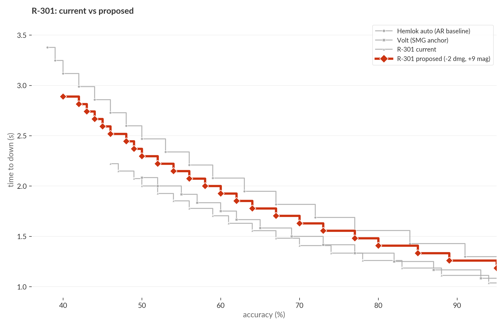
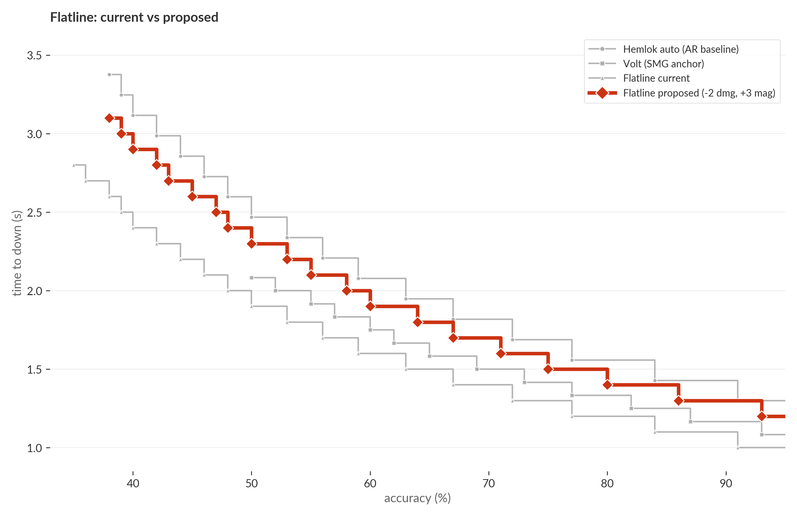

# Three ARs for long range: R-301, Flatline, Hemlok

Apex's long-range AR class has one weapon doing too much (R-301: easy-mode beam *and* close-range trade), one weapon nobody uses for its identity (Flatline: skill weapon dominated by being also-fast), and one weapon doing exactly what it should (Hemlok: heavy-hitter baseline). The fix isn't a generic nerf. It's letting each weapon be the thing it's already mechanically built to be.

This post leads with R-301 (-2 dmg / +9 mag) and ends with Flatline (-2 dmg / +3 mag). Hemlok stays unchanged. The result is three coherent long-range AR identities with no single dominant pick.

## R-301: -2 damage, +9 mag

R-301 is already mechanically a beam. It has the lowest recoil of any AR, the smallest damage falloff curve, and at 810 RPM is the smoothest cadence in the class. The reason it isn't *only* a beam is that its close-range numbers are also good enough to win most SMG fights — currently 0.96s to down [(#r301-current)](#r301-current), faster than Volt (1.00s) and Hemlok auto (1.17s), second only to R-99 and CAR among full autos. There's no commitment cost to picking R-301; it just wins everywhere.

Proposed 13/40 lifts time-to-down to **1.11s** [(#r301-proposed)](#r301-proposed) and bumps mag from 31 to 40. Per-mag damage moves from 465 to 520 (+12%), minimum accuracy to one-clip from 45% to 40%.



The proposal does not give R-301 long-range tools it doesn't already have. The low recoil, low falloff, mag depth, and high cadence are all already in the weapon. What this does is remove the close-range power that lets R-301 also win SMG-distance fights, leaving the existing long-range mechanics to define what the weapon is for. R-301 stays the long-range beam by being *only* the long-range beam.

The +9 mag is the largest single floor-loot magazine in Apex history. The current ceiling is HAVOC and Nemesis at 32; no purple base AR has ever shipped at 40. The reason it's the right number is that R-301's recoil control rewards muscle memory past round 30 in a way no other AR's does — the extra rounds reward the player who has trained on R-301's pattern, and only on R-301's pattern. For any other AR the same +9 would be padding.

## Flatline: -2 damage, +3 mag

Flatline is the AR that always *should* have been the skill pick. Its vertical recoil is the steepest pattern in the class; landing all 29 rounds at distance is a real test of muscle memory. But there's currently no incentive to commit, because Flatline is *also* fast at close range — 0.90s to down [(#flatline-current)](#flatline-current), comparable to R-301 and faster than Volt. So the harder-to-use weapon doesn't get picked for its hard-to-use angle; it gets picked when it's already the available best floor-loot pickup.

Proposed 18/32 lifts time-to-down to **1.10s** [(#flatline-proposed)](#flatline-proposed) and bumps mag from 29 to 32 (matching Hemlok's class siblings, not exceeding them). Per-mag damage stays effectively flat (580 → 576). Minimum accuracy to one-clip moves from 35% to 38%.



Flatline's role under this proposal is the *intentional* AR pick — the weapon you choose because you trust your recoil control over distance. The reward isn't a fast TTK at close range; it's that landing 32 controlled rounds at 60m beats every other AR for raw damage delivered, and the recoil pattern punishes anyone who can't commit. Hemlok hits hard once; Flatline hits hard for a full magazine if you can hold the line.

## Hemlok stays the heavy-hitter

Hemlok's job is to land a few well-aimed rounds into the next part of the engagement. 22 damage per shot at 462 RPM auto means a single hit cracks a quarter of a purple shield; the slower cadence means each pull of the trigger is a real decision rather than a held button. Hemlok's t_down at 1.17s [(#hemlok-baseline)](#hemlok-baseline) is the longest of the three but also the most consistent — the per-shot damage profile is least sensitive to accuracy. No change recommended.

## The three-AR portfolio

| weapon | identity | dmg x mag | RPM | t_down @ 100% | a_down |
|---|---|---|---:|---:|---:|
| R-301 (proposed) | low-recoil beam, lowest skill floor at range | 13 x 40 | 810 | 1.11s | 40% |
| Flatline (proposed) | skill choice, biggest reward for recoil control | 18 x 32 | 600 | 1.10s | 38% |
| Hemlok (no change) | heavy-hitter baseline, slow cadence punish | 22 x 27 | 462 | 1.17s | 37% |

Three weapons, three reasons to pick them. R-301 if you want range without thinking. Flatline if you can hold the recoil. Hemlok if you want each shot to land like a hammer. None of them is the best pick for *every* engagement, which is the goal.

## What this doesn't do

It doesn't make any AR objectively better at range. The model is range-flat — t_down is calculated against an idealized 60m or 6m target. Recoil patterns, projectile speed, and damage falloff are tuned by Respawn separately and would be the actual levers if Respawn wanted to *buff* long-range output. What this proposal does is remove the close-range advantage that makes the choice between these three weapons trivial, so the existing long-range mechanics (already differentiated) become the deciding factor.

It also doesn't address other long-range autos (HAVOC, Spitfire, L-STAR, Rampage), which sit faster than Hemlok by similar margins. Each is a separate identity question and would dilute this post; held for follow-ups.

## Caveats

- **Recoil and falloff.** Range-flat model. The "beam" and "skill" framings depend on Respawn's existing tuning of these parameters; the proposal does not modify them.
- **Numbers are expectation-based.** At exactly the minimum accuracy to one-clip, the kill happens *on average*, not every time.
- **Pro accuracy distribution.** ALGS Y6 shot-weighted accuracy quantiles: q25 = 18%, q50 = 25%, q75 = 56% [(#pro-acc)](#pro-acc). Both proposed a_downs (40% R-301, 38% Flatline) sit comfortably below pro q75.

---

## Methodology

The model is the same as in [post 1: R-99 paired -2 dmg / +5 mag](../r99_nerf/post.md): 200 HP target (100 shield + 100 health), one-magazine bound, time-to-down at full accuracy as the headline metric, minimum accuracy to one-clip as the secondary. Hits-to-kill use game-accurate overspill on the shield-breaking bullet (a hit that breaks the shield credits its residual raw damage to health on the same hit). Bullets fired at accuracy `a` is `ceil(hits / a)` — no fractional bullets.

## Notes

<a id="r301-current">**r301-current.**</a> R-301 current t_down at full accuracy. **Derived.** Damage 15, magazine 31, RPM 810. Shield: 6 full hits = 90; the 7th hit overspills 5 to health. Health: `ceil(95/15)` = 7. Total hits = 14. Time = `13 * 60 / 810` = 0.963s. a_down = `14 / 31` = 45.2%.

<a id="r301-proposed">**r301-proposed.**</a> R-301 proposed t_down at full accuracy. **Derived.** Damage 13, magazine 40, RPM unchanged. Shield: 7 full hits = 91; the 8th hit overspills 4 to health. Health: `ceil(96/13)` = 8. Total hits = 16. Time = `15 * 60 / 810` = 1.111s. a_down = `16 / 40` = 40.0%.

<a id="flatline-current">**flatline-current.**</a> Flatline current t_down at full accuracy. **Derived.** Damage 20, magazine 29, RPM 600. Shield: 5 hits = 100 exact, no overspill. Health: `ceil(100/20)` = 5. Total hits = 10. Time = `9 * 60 / 600` = 0.900s. a_down = `10 / 29` = 34.5%.

<a id="flatline-proposed">**flatline-proposed.**</a> Flatline proposed t_down at full accuracy. **Derived.** Damage 18, magazine 32, RPM unchanged. Shield: 5 full hits = 90; the 6th hit overspills 8 to health. Health: `ceil(92/18)` = 6. Total hits = 12. Time = `11 * 60 / 600` = 1.100s. a_down = `12 / 32` = 37.5%.

<a id="hemlok-baseline">**hemlok-baseline.**</a> Hemlok auto t_down at full accuracy (the AR baseline anchor in the charts). **Derived.** Damage 22, magazine 27, RPM 462 (auto-mode rate, applied since the S28.1 Aftershock event). Shield: 4 full hits = 88; the 5th hit overspills 10 to health. Health: `ceil(90/22)` = 5. Total hits = 10. Time = `9 * 60 / 462` = 1.169s.

<a id="volt-anchor">**volt-anchor.**</a> Volt t_down at full accuracy (the SMG anchor in the charts). **Derived.** Damage 16, magazine 26, RPM 720. Shield: 6 full hits = 96; the 7th overspills 12 to health. Health: `ceil(88/16)` = 6. Total hits = 13. Time = `12 * 60 / 720` = 1.000s.

<a id="pro-acc">**pro-acc.**</a> Pros' shot-weighted accuracy distribution across weapons in ALGS Y6. **Quote.** From `analyze_ettk.py` log line `Y6 accuracy quantiles`: q25 = 0.18, q50 (median) = 0.25, q75 = 0.56. Source: `output/ettk_summary.md`.

## Reproducibility

Per-weapon raw values used in this post:

| weapon | dmg | mag | RPM | head mult | shield mult | health mult |
|--------|----:|----:|----:|----------:|------------:|------------:|
| R-301 Carbine (current) | 15 | 31 | 810 | 1.75 | 1.0 | 1.0 |
| R-301 (proposed) | 13 | 40 | 810 | 1.75 | 1.0 | 1.0 |
| VK-47 Flatline (current) | 20 | 29 | 600 | 1.75 | 1.0 | 1.0 |
| Flatline (proposed) | 18 | 32 | 600 | 1.75 | 1.0 | 1.0 |
| Hemlok Breach AR (auto) | 22 | 27 | 462 | 1.409 | 1.0 | 1.0 |
| Volt SMG | 16 | 26 | 720 | 1.25 | 1.0 | 1.0 |

To regenerate every chart and number in this post:

```bash
git clone https://github.com/mo-arvan/apexlegends-data-analysis
cd apexlegends-data-analysis
uv run python src/build_ettk_inputs.py
uv run python src/analyze_ettk.py
uv run python src/plot_ettk.py
```

Charts come from `fig_story()` in `src/plot_ettk.py` (`story_lra_r301` and `story_lra_flatline` entries in `main()`). Hemlok and Volt are fixed `style: "anchor"` entries; each weapon's current state is also anchored; the proposed line is the `style: "highlight"` entry with overrides applied.

---

**Code + data**: [github.com/mo-arvan/apexlegends-data-analysis](https://github.com/mo-arvan/apexlegends-data-analysis). Part 2 of a per-weapon balance series. Part 1: [R-99 paired -2 dmg / +5 mag](../r99_nerf/post.md).
