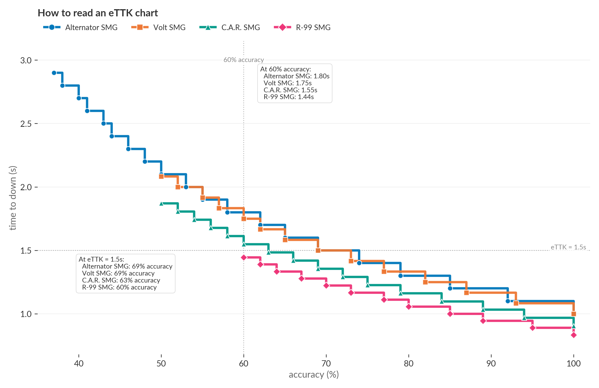
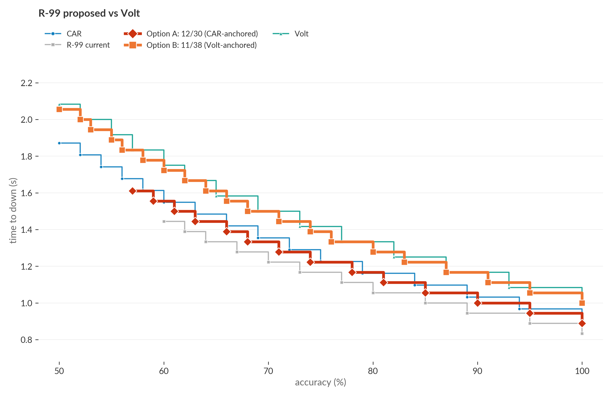
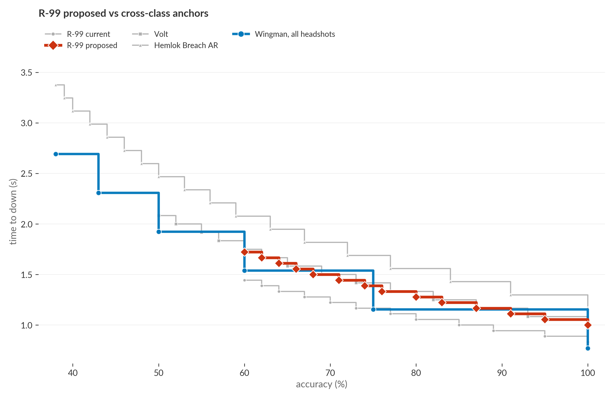

# Prediction: R-99 will become the S29 SMG meta

## Summary

S29 launched today. The patch did not change R-99. C.A.R. returned to floor loot at 14 damage and 30 magazine. R-99 still leads the floor SMG class.

R-99 deals more damage per second than any other floor SMG. R-99's damage per second (DPS) is 234. C.A.R. is 217. Volt is 192. Alternator is 190. The DPS lead holds at any accuracy, not just at perfect aim.


R-99 has one weakness: it needs the highest accuracy to kill a 200 HP target in one magazine. R-99 needs 60%. C.A.R. and Volt need 50%. Alternator needs 37%. R-99 demands the most precision to one-clip.

R-99's DPS lead overrules the threshold weakness. I analyzed 21,884 R-99 firing bursts in ALGS data since the S24 patch. Pros reach 60% accuracy on 5% of them. Those bursts one-clip and deliver 11% of all R-99 damage. The other 95% fire below threshold and do not one-clip. R-99 still deals more damage per second there than C.A.R., Volt, or Alternator. R-99 has the highest DPS at every accuracy.

Two changes can bring R-99 in line. Option A: 12 damage, 30 magazine. R-99 drops to 216 DPS (equal to C.A.R.) and a 57% threshold. Option B: 11 damage, 38 magazine. R-99 drops to 198 DPS (equal to Volt) and a 50% threshold. Both options keep R-99 at 1080 rounds per minute. The trigger feel stays.

---

DPS and theoretical TTK are the standard numbers used to compare weapons in shooters. DPS is damage times rate of fire. Theoretical TTK is shots-to-kill at perfect accuracy. They are easy to compute from the raw stats. They are what most balance arguments default to. They are also wrong for the question that matters in a fight. They ignore two variables that decide actual engagements: **accuracy** and **magazine size**.

Accuracy is variable. Pros land between 20% and 60% of their shots in a real fight, not 100%. DPS at perfect accuracy is a number nobody experiences. Magazines are bounded. The fight question is not whether the weapon can theoretically deliver 200 HP. It is whether the weapon delivers 200 HP before the magazine empties.

The two combine into a hard threshold the smooth-DPS view averages away. If a weapon needs 16 hits and the magazine holds 27 bullets, the player one-clips at 60% accuracy and above. Below 60% they cannot. There is no value of "fire longer" that fixes it. The weapon goes from "slower" to "can't kill at all inside one mag." DPS treats accuracy as continuous. The game has a cliff.

The question that matters is: **inside one magazine, how fast does this weapon kill at the accuracy a player can actually hold?**

The metric this post and the rest of the series use is **effective TTK** (eTTK): seconds to kill a 200 HP target as a function of accuracy, bounded by one magazine. It has two summary values worth quoting. **eTTK at full accuracy** is the floor a perfect player gets. **Minimum accuracy to one-clip** is the smallest accuracy at which the player can still finish inside one mag. Both are observable in-game. Full-accuracy eTTK is something a pro can stopwatch in the firing range. The threshold is something they feel in fights.

A few practical details about the model. The target is 200 HP total: 100 HP of purple shield plus 100 HP body. The shield-breaking bullet's residual damage spills to health on the same hit. Body shots only, with the Wingman cross-class example as the one exception.

The only ceiling is on bullets fired: `n = ceil(hits / accuracy)`. You cannot fire a fractional bullet. Single attacker, single target, no reload, no recoil, no movement modeled. The full assumption list is below.

The short version: eTTK answers "inside one mag, who kills first." It is not a complete combat simulator.

Here is the eTTK curve for the four floor-loot SMGs as the class stands today:


Each line is one weapon's eTTK across the accuracy range. The curves step because the math is integer. You can't fire half a bullet, so each step down is one fewer bullet needed. The leftmost point of each line is the weapon's minimum accuracy to one-clip. Below that point the weapon can't finish a 200 HP target in one mag. The rightmost point at 100% accuracy is the floor a perfect player gets.

R-99 is the bottom curve from 60% accuracy upward. Above 60% R-99 kills fastest in the class on time-to-kill. Below 60% R-99 cannot one-clip a 200 HP target. C.A.R. and Volt one-clip down to 50%. Alternator one-clips down to 37%. Note: eTTK only describes one-clip kill speed. R-99 has the highest damage per second at every accuracy regardless of whether the one-mag bound is met.

To make the chart concrete, here is the same set of curves with two reference lines and a pair of readouts:



The vertical line at 60% accuracy gives the eTTK each weapon delivers at that accuracy (top-right readout). The horizontal line at 1.5s gives the accuracy each weapon needs to reach eTTK = 1.5s (bottom-left readout). R-99 at 60% accuracy already kills in 1.44s. Alternator at the same accuracy needs 1.80s. To kill in 1.5s, R-99 needs only 60% accuracy. Alternator needs 69%.

The rest of this post applies eTTK to R-99 and presents two paired-cut options ahead of S29 (Monday).

## Why R-99 dominates

R-99 leads ALGS Y6 in shots landed by 3x the next-most-used SMG: 48,185 to Alternator's 14,124 [(#r99-pickrate)](#r99-pickrate). Respawn cut R-99 damage from 14 to 13 in February 2025 [(#feb-2025)](#feb-2025); peak eTTK moved from 0.78s to 0.83s. Pick rate did not move.

R-99's high RPM (1080) gives it two compounding advantages:

- **Fastest peak eTTK in the class.** At 100% accuracy R-99 kills a 200 HP target in 0.83s [(#down-current)](#down-current). C.A.R. takes 0.90s [(#car-down)](#car-down). Volt takes 1.00s [(#volt-down)](#volt-down). When both players land their shots, R-99 finishes first.
- **Smallest time penalty per missed shot.** Each missed shot costs R-99 0.056s. C.A.R. loses 0.065s. Volt loses 0.083s. R-99's peak lead carries across most of the eTTK curve as accuracy slips.

R-99 isn't just the fastest. It's the fastest with the most forgiving deviation from optimal. A single-direction damage nudge moves the peak number but leaves the miss-penalty untouched. That's why the Feb 2025 cut didn't move pick rate.

## What pros actually do with R-99

The empirical lens is per-burst accuracy across 21,884 R-99 firing bursts in ALGS since the S24 patch [(#empirical-source)](#empirical-source). Each burst is one continuous trigger pull with measured `shots_hit / ammo_used`. No averaging across reposition pauses or exploratory shots.

**Pros rarely reach the threshold.** Pros land 60% accuracy on 5% of R-99 bursts. They land 80% on 1%. Median R-99 burst accuracy is 25%. The 60% threshold is not where pros usually fight. It is where a few clutch moments land. But those 5% deliver 11% of all R-99 damage [(#burst-acc)](#burst-acc), because high-accuracy bursts are also high-damage bursts. 1 in 20 bursts produces 1 in 9 damage points. That is the band where one-clip thresholds matter.

**Lower-threshold weapons hit their thresholds more often.** Pros reach Alternator's 37% threshold on 21% of Alternator bursts. Prowler's 30% on 35%. Volt's 50% on 10%. R-99's 59% on only 5%. R-99's threshold is the hardest to reach in the floor SMG class. Yet R-99 leads pick rate.

**The DPS lead applies at every accuracy point.** R-99's theoretical DPS is 234. C.A.R. is 217. Volt is 192. Alternator is 190. The ranking is the same at every accuracy. At 25% accuracy R-99 delivers ~58 effective DPS to the target. C.A.R. delivers ~54. Volt delivers ~48. Each missed shot costs R-99 0.056s of fire time vs C.A.R.'s 0.065s vs Volt's 0.083s. Accuracy variance hurts R-99 less than competitors.

**The eTTK debate is about the 19% of engagements that end in a kill.** Across all pro engagements, only 19% end in a down. 35% end with the victim healing back to full. 46% end idle. The median engagement delivers 88 HP in 6 seconds at 33% accuracy. eTTK describes the kill speed in the engagements that produce kills, not the broader chip-and-trade that fills most pro engagement time. That 19% is also the 19% that decides games.

## Two proposals, anchored to CAR or Volt

The eTTK model has two knobs:

- **Damage** sets effective DPS. The DPS ranking applies at every accuracy.
- **Damage divided by magazine** sets the one-clip accuracy threshold. This decides whether the player can finish in one mag.

Tuning only one knob misses one question. Consider cutting R-99 damage to 11 with no mag bump. The threshold jumps from 60% to **70%** [(#proposed-min-acc)](#proposed-min-acc). Pro q75 is 56% [(#pro-acc)](#pro-acc). Most pro engagements never reach 70%. R-99 would feel almost unusable. You would reload mid-fight more often than kill. The Feb 2025 single-tick cut (14 to 13) avoided this because it was small. A bigger cut needs the mag bump to keep the threshold reachable. The choice of *how* big a mag bump is really a choice of which floor SMG to anchor R-99's curve against.

**The math gives the recipe directly.** With R-99's RPM held at 1080, both knobs solve from one anchor weapon:

1. **Equal DPS** to the anchor: `new_damage = anchor_DPS x 60 / 1080`. CAR's 217 DPS gives 12.06; round to **12**. Volt's 192 DPS gives 10.67; round to **11**.
2. **Equal `a_down`** to the anchor: at damage d, total hits to deliver 200 HP after overspill is `h(d)`; required mag is `h(d) / target_a_down`. At damage 12, h(12) = 17 hits, so matching CAR's 50% threshold wants mag = `17 / 0.5 = 34`. At damage 11, h(11) = 19 hits, matching Volt's 50% wants mag = `19 / 0.5 = 38`.

The math-exact pairs are (12, 34) for CAR-anchored and (11, 38) for Volt-anchored. Option B takes both math-exact values. Option A rounds the mag down to **30**, the largest floor-loot mag R-99 has historically shipped with [(#respawn-precedent)](#respawn-precedent), accepting a 57% threshold instead of an exact 50% match. The chart below shows the resulting curves; the math is the source of the proposals, the chart is the confirmation.

**Option A, CAR-anchored: -1 damage, +3 mag (12/30).** R-99 lands on CAR's curve. eTTK at full accuracy is 0.89s, basically tied with CAR's 0.90s. Minimum accuracy to one-clip is 57%, slightly above CAR's 50% but in the same neighborhood. Under this option, R-99 and CAR become peers in close-range duty: same eTTK floor, similar accuracy threshold, differentiated only by trigger feel: R-99's 1080 RPM cadence vs CAR's 14-damage punch. The argument for this anchor: smallest disruption to R-99 and a clean continuation of the Feb 2025 nerf direction. The argument against: there's not much daylight between R-99 and CAR, and most players would still pick the slightly faster CAR if both are on the floor.

**Option B, Volt-anchored: -2 damage, +11 mag (11/38).** R-99 lands on Volt's curve. eTTK at full accuracy is 1.00s, exactly Volt's. Minimum accuracy to one-clip is 50%, exactly Volt's. The +11 mag is what makes the anchor exact: 19 hits ÷ 38 mag = the same a_down as Volt's 13 ÷ 26. Under this option, R-99 takes Volt's role-shape (slower peak, deeper accuracy floor) but with R-99's cadence and mag depth. CAR keeps the high-accuracy peak; R-99 covers the longer-engagement, lower-accuracy slot. The argument for this anchor: R-99 occupies a clearly different niche from CAR rather than overlapping it. The argument against: 38-round R-99 has never shipped as floor loot since the 2019 launch.



The chart shows both options against the two anchors. Option A (red) tracks C.A.R.'s curve all the way across. Option B (orange) tracks Volt's curve all the way across. Either option closes the "uniquely fastest" gap. The difference is which floor SMG R-99 ends up resembling.

| variant | dmg x mag | minimum accuracy to one-clip | eTTK at full accuracy | anchor |
|---|---|---|---|---|
| R-99 current | 13 x 27 | 59% | 0.83s | none (uniquely fastest) |
| Option A | 12 x 30 | 57% | 0.89s | CAR (0.90s, 50%) |
| Option B | 11 x 38 | 50% | 1.00s | Volt (1.00s, 50%) |
| CAR (S29 floor) | 14 x 30 | 50% | 0.90s | the lower anchor |
| Volt | 16 x 26 | 50% | 1.00s | the upper anchor |

Either option restores meaningful choice between R-99, CAR, and Volt. Option A says "R-99 joins CAR at the fast end"; Option B says "R-99 joins Volt at the patient end."

One asymmetry the eTTK curves don't show: cadence. R-99's 1080 RPM next to CAR's 930 RPM is a 16% gap. The two weapons start to feel similar at the trigger when their curves match. R-99 next to Volt's 720 RPM is a 50% gap. At the trigger they feel like entirely different weapons even when the eTTK curves overlap. Option A merges R-99's feel into CAR's; Option B keeps R-99's distinctive high-cadence identity while matching Volt's curve.

**Equalizing DPS doesn't equalize weapon identity.** The natural objection to either proposal is that aligning R-99's curve with another floor SMG flattens its feel. Volt and Alternator already settle this empirically. They have effectively identical theoretical DPS today (192 vs 190) and nobody confuses them in a fight. Volt is energy ammo at 16 damage and 720 RPM, smooth and steady. Alternator is heavy ammo at 19 damage and 600 RPM, chunkier punches at slower cadence. They diverge on per-shot damage, ammo class, recoil pattern, mag size, and `a_down` (50% vs 37%). DPS is one axis of weapon identity; per-shot damage, RPM, recoil, ammo, and threshold are five more. Both proposals leave R-99 at 1080 RPM, the highest cadence in the floor SMG class by a wide margin. Even when its damage and mag align with another weapon's curve, the trigger feel and per-shot punch stay distinct. Option A makes R-99 *similar* to CAR on the curves the eTTK model captures, not a copy on the dimensions players experience.

## Cross-class context



R-99 stays below Hemlok at every realistic accuracy [(#hemlok-down)](#hemlok-down). SMGs stay faster than ARs. Wingman with all headshots [(#wingman-head)](#wingman-head) needs 3 hits. Wingman plateaus at 1.15s once accuracy reaches 75% (4 bullets fired). That is faster than R-99 proposed in that accuracy band, but only if every shot lands a head. Three-headshot Wingman is a different fantasy than spray-down R-99. R-99's role as the high-volume, fast-cadence weapon stays intact under the proposals. R-99 just stops being uniquely *fastest*.

## What Respawn has tried

| era | dmg | mag | notes |
|---|---|---|---|
| Feb 2019 launch | 12 | 30 | dominant in S0-S2 |
| S3 (Oct 2019) - Aug 2024 | 11-12 | 26-28 | floor-loot oscillation |
| S22 Care Package (Aug 2024) | 14 | 30 | +dmg and +mag, CP only |
| S24 (Feb 2025) | 13 | 26 | floor return; -dmg, no mag |
| March 2025 mid-season | 13 | 27 | +1 mag, undersized |
| Current | 13 | 27 | head damage 17 since Apr 2025 |

The S22 Care Package shows Respawn pairs `+dmg` with `+mag` to reposition a weapon. The Option A pairing (12/30) sits inside historical floor-loot precedent. The Option B pairing (11/38) is more aggressive: 38-round R-99 has never shipped as floor loot since the 2019 launch.

## Assumptions and what isn't modeled

The eTTK model is deliberately small. Surfacing what it does and doesn't capture is more useful than pretending it captures everything.

### Modeling

- **Target is 200 HP: 100 shield + 100 body, purple-tier.** Pros engage at purple most of the time. Blue (75 shield) is faster to kill; red (125 shield) is slower. The choice of 200 HP is not arbitrary but isn't the only valid baseline.
- **Body shots only**, except where headshots are called out (the Wingman cross-class example). Pros land roughly 5-15% headshots in real fights; eTTK is therefore a slight upper bound on real-fight kill speed.
- **Constant accuracy across the magazine.** Real accuracy varies inside one burst (first shots land cleaner than the tail under recoil). The model treats accuracy as a single scalar, so the curve is a smoothed approximation of behavior.
- **Single attacker, static target.** No teammate damage credit; the target doesn't juke, slide, peek, or escape. Pro-realistic accuracy implicitly encodes some target evasion, but the model treats the target as in the bullet path.
- **One bullet per trigger pull** for the SMGs in scope. Burst weapons (Hemlok, Prowler, Alternator [Double Tap]) are handled via `burst_fire_delay`; the Alternator Double Tap variant (two bullets per trigger at 15 each) is a different weapon than base Alternator and not in the floor-SMG comparison.
- **One magazine, no reload, no weapon swap, no mag refill.** This is the actual decision boundary of pro engagements [(#no-reload)](#no-reload), but it's a simplification. Long sustained fights span multiple mags.
- **Recoil, strafe speed, hipfire spread, visibility, ADS time, movement penalty when equipped.** None of these are in eTTK. Respawn tunes them separately. R-99's old "no movement penalty" property was a real combat advantage **not** captured by the model. Removing it (Feb 2025) was a significant nerf the eTTK math missed.
- **Expectation-based.** At exactly the minimum accuracy to one-clip, the kill happens *on average*, not every time.

### Data

- **Damage values reflect ALGS Y6 observed shots.** Y6 ran on patches before today's S29 Overclocked release; observed-damage stats are pre-S29. Mag, RPM, and reload come from the post-S29 patch chain plus the wiki where the patch chain has gaps.
- **Pro accuracy is from the ALGS shot-weighted distribution** (q25=18%, q50=25%, q75=56%). Diamond/Masters ranked play has different accuracy distributions; the model would need re-fitting for that scope.
- **"Current" weapon stats are as of S29 Overclocked (May 4, 2026),** the patch that dropped today. No weapon-stats changes affect the floor SMGs in scope.

### Implicit balance premise

- The post argues for matching R-99's accuracy threshold (`a_down`) to CAR's or Volt's, **not** for matching its full-accuracy eTTK floor. The implicit premise is that **floor SMGs should be roughly interchangeable in accessibility**, so the choice between them is preference, not a strict upgrade for the player who can hold higher accuracy. A reader who thinks floor SMGs *should* have a single best option (and others as fallback) would draw different conclusions from the same eTTK curves.
- **Pick rate and shots-landed are imperfect proxies for effectiveness.** R-99's 48k shots in Y6 could mean it's strictly best, or that pros pick it from habit and the small per-shot advantages compound across thousands of engagements. The post leans on the second interpretation but can't rule out the first.

### S29 mechanics not in the model

- **Sliding Shooter** (new in S29): bullets fired while sliding come from inventory rather than magazine, capped at 50% of mag size. Effectively gives slide-shooters extra ammo for the slide portion of a push. The eTTK floor for slide-pushed engagements is lower than reported here.
- **Chain Healing:** changes mid-fight heal animation timing but not eTTK directly.
- **Deathbox respawns:** reshapes the strategic value of kills (a downed teammate can come back at a deathbox), but doesn't change the per-engagement kill math.

These mechanics will affect the empirical eTTK distribution in S29 data once it's collected. Modeled eTTK is unchanged.

---

## Math (the model in equations)

The reasoning behind the model is in the opening; what follows is the calculation.

For damage `d`, pellets per shot `p`, magazine size `m`, RPM `r`, shield multiplier `e`, health multiplier `h`, at accuracy `a`:

1. Hits at full damage to break the shield: `k_s = ceil(100 / (d * p * e))`. The shield-breaking hit overspills, dealing residual raw damage `d * p - shield_remaining / e` to health at rate `h`.
2. Hits to clear remaining health: `k_h = ceil(health_left_after_overspill / (d * p * h))`.
3. Total hits needed: `k = k_s + k_h`.
4. Bullets fired at accuracy `a`: `n = ceil(k / a)`. If `n > m`, the weapon cannot one-clip at that accuracy.
5. Time-to-down: `(n - 1) * 60 / r` for auto weapons. Burst weapons add `burst_fire_delay` between bursts.
6. Minimum accuracy to one-clip: `k / m`.

The model is bounded by one magazine [(#no-reload)](#no-reload). Earlier iterations used reload-inclusive eTTK and sustained eDPS [(#model-history)](#model-history); both were abandoned because the one-mag bound is the actual decision boundary in pro engagements.

## Notes

<a id="down-current">**down-current.**</a> R-99 current eTTK at full accuracy. **Derived.** Damage 13, pellets 1, magazine 27, RPM 1080, shield/health multipliers 1.0. Shield phase: 7 full hits leave 9 shield (100 - 7*13 = 9); the 8th hit uses 9 raw on shield and overspills 4 to health. After 8 hits: shield 0, health 96. Health phase: `ceil(96 / 13)` = 8 hits. Total hits = 16. Time = `15 * 60 / 1080` = 0.833s.

<a id="proposed-down">**proposed-down.**</a> R-99 proposed eTTK at full accuracy, both options. **Derived.** *Option A (damage 12, mag 30):* Shield: 8 full hits leave 4 shield (100 - 96); the 9th overspills 8 to health. Health: `ceil((100 - 8) / 12)` = 8. Total hits = 17. Time = `16 * 60 / 1080` = 0.889s. *Option B (damage 11, mag 38):* Shield: 9 full hits leave 1 shield (100 - 99); the 10th overspills 10 to health. Health: `ceil(90 / 11)` = 9. Total hits = 19. Time = `18 * 60 / 1080` = 1.000s.

<a id="car-down">**car-down.**</a> CAR eTTK at full accuracy at base S29 stats (no hop-up default-equipped). **Derived.** Damage 14, magazine 30, RPM 930, shield/health multipliers 1.0. Shield: 7 full hits = 98; the 8th hit uses `2/1` = 2 raw on shield and overspills `14 - 2` = 12 to health. Health: `ceil((100 - 12) / 14)` = 7. Total hits = 15. Time = `14 * 60 / 930` = 0.903s.

<a id="s29-car">**s29-car.**</a> CAR returning to floor loot in S29 (out of Care Package). **Quote.** Per-weapon stats post-S29: damage 14, gold mag 30 (was 28), RPM 930. The S29 patch removed CAR's default-equipped Galvanic Gavel hop-up and bumped mag sizes ("Blue 25 → 26, Purple/Gold 28 → 30"). Floor-loot CAR now runs at base shield/health multipliers (1.0/1.0). The S29 eTTK at full accuracy is 0.903s, still the closest SMG to R-99.

<a id="volt-down">**volt-down.**</a> Volt eTTK at full accuracy. **Derived.** Damage 16, magazine 26, RPM 720. Shield: 6 full hits = 96; the 7th overspills 12 to health. Health: `ceil(88 / 16)` = 6. Total hits = 13. Time = `12 * 60 / 720` = 1.000s.

<a id="hemlok-down">**hemlok-down.**</a> Hemlok Breach AR eTTK at full accuracy. **Derived.** Damage 22, magazine 27, RPM 462 (Hemlok's auto-mode rate, applied since the S28.1 Aftershock event). Shield: 4 full hits = 88; the 5th overspills 10 to health. Health: `ceil(90 / 22)` = 5. Total hits = 10. Time = `9 * 60 / 462` = 1.169s.

<a id="wingman-head">**wingman-head.**</a> Wingman eTTK at full accuracy with every shot landing a headshot. **Derived.** Damage 50, headshot multiplier 1.92 (with Skullpiercer, on by default in this analysis), magazine 8 (purple/gold), RPM 156. Per-hit damage = `50 * 1.92` = 96. Shield: 1 hit deals 96, leaves 4 shield; the 2nd hit overspills `96 - 4` = 92 to health. Health: `ceil((100 - 92) / 96)` = 1. Total hits = 3. Minimum accuracy to one-clip = `3 / 8` = 37.5%. At a = 1.0, bullets fired = 3, time = `2 * 60 / 156` = 0.769s. The 4-bullet plateau in [0.75, 1.0) sits at `3 * 60 / 156` = 1.154s. Three hits mean three shots only when every shot lands.

<a id="r99-pickrate">**r99-pickrate.**</a> R-99 shots landed in ALGS Y6 Pro League. **Quote.** 48,185, from `data/weapon_stats_for_ettk.csv`, `y6_shots_hit` column. Next-highest SMG is Alternator at 14,124.

<a id="r99-min-acc">**r99-min-acc.**</a> R-99 minimum accuracy to one-clip. **Derived.** Hits needed (see #down-current) = 16. Smallest `a` where `ceil(16 / a) <= 27`: `a >= 16 / 27 = 0.593`. Minimum accuracy = 59.3% (rounded to 60% in the body).

<a id="proposed-min-acc">**proposed-min-acc.**</a> R-99 proposed minimum accuracy to one-clip, both options. **Derived.** *Option A:* hits needed = 17, `a >= 17 / 30 = 0.567`. Minimum accuracy = 56.7% (rounded to 57%). *Option B:* hits needed = 19, `a >= 19 / 38 = 0.500`. Minimum accuracy = 50.0%, exactly Volt's threshold (Volt: 13 / 26 = 0.500). The cut-only counterfactual (damage 11, magazine 27) gives `a >= 19 / 27 = 0.704`, i.e. 70%; neither paired option lets that happen.

<a id="pro-acc">**pro-acc.**</a> Pros' shot-weighted accuracy distribution across weapons in ALGS Y6. **Quote / derived.** From `analyze_ettk.py` log line `Y6 accuracy quantiles`: q25 = 0.18, q50 (median) = 0.25, q75 = 0.56. Source: `output/ettk_summary.md` and the analyze run log.

<a id="feb-2025">**feb-2025.**</a> Respawn's S24 patch (Feb 10, 2025): R-99 damage 14 -> 13, headshot damage 16, no longer has damage falloff. **Quote.** Apex Legends wiki R-99 patch history; cross-checked against `data/patch_note_deltas.csv`.

<a id="no-reload">**no-reload.**</a> Why the model does not include reload. **Derived from prior iterations.** At pro accuracy, reload time dominates time-to-kill metrics that include reload, creating mag-boundary discontinuities that obscure weapon-to-weapon comparisons. Pros also swap to a secondary instead of reloading mid-engagement. Modeling the swap requires assuming a specific secondary, which is loadout-dependent.

<a id="model-history">**model-history.**</a> Why one-clip, not eTTK or eDPS. **Derived.** Documented in [`docs/posts/ettk_s28_1/technical.md`](../ettk_s28_1/technical.md): the full methodology arc with limitations of each prior model.

<a id="respawn-precedent">**respawn-precedent.**</a> Largest floor-loot mag R-99 has historically shipped with. **Quote.** 30 rounds in the Aug 2024 Care Package version (S22, with damage 14). Floor-loot mags have oscillated 26-28 since the S3 (Oct 2019) re-introduction; 30 rounds has only existed in the Care Package and the S6 reworked floor variant. 34-round R-99 has never shipped on the floor; 38-round R-99 has never shipped at all. Source: the S22 Care Package row in the "What Respawn has tried" table above, cross-checked against `data/weapon_history.csv`.

<a id="burst-acc">**burst-acc.**</a> Per-burst accuracy distribution across all SMG firing bursts in ALGS since the S24 patch. **Derived.** Filter: `weapon_name in {R-99 SMG, C.A.R. SMG, Volt SMG, Alternator SMG, Prowler Burst PDW}` AND `game_timestamp >= 2025-02-10` AND `ammo_used > 0` AND `shots_hit / ammo_used <= 1.0` (drops a small set of malformed events). Each burst is one entry in `data/tournament_damage_events`; per-burst accuracy is `shots_hit / ammo_used`. "% at own threshold" uses each weapon's modeled `a_down`.

| weapon | a_down | n_bursts | % at own threshold | % at 60% | % at 80% | median acc | % of total damage at 60%+ |
|---|---|---|---|---|---|---|---|
| R-99 SMG | 59% | 21,884 | 5% | 5% | 1% | 25% | 11% |
| Volt SMG | 50% | 1,716 | 10% | 4% | 1% | 22% | 8% |
| Alternator SMG | 37% | 4,333 | 21% | 3% | 1% | 22% | 6% |
| Prowler Burst PDW | 30% | 491 | 35% | 3% | 1% | 20% | 5% |

R-99's 60% accuracy floor is the hardest of the floor SMGs to reach. The threshold-reach rate scales inversely with the threshold value: lower threshold → more frequent threshold hit. R-99 wins pick rate despite the rarest threshold-hit because the curves below threshold (the volume-chip regime, 95%+ of bursts) also favor R-99 by cadence and per-shot miss-penalty.

<a id="empirical-source">**empirical-source.**</a> Source for the empirical-vs-modeled comparison and the engagement-landscape numbers. **Derived.** 58,807 ALGS pro engagements reconstructed from damage / down / heal / kill events, filtered to since 2025-02-10 (post-S24 patch). Engagements built by a state-based walker that opens on first damage and closes on down / full heal-back / 30s idle. Empirical eTTK uses down-ending engagements with single-attacker share >= 80% and one-magazine ammo budget. Per-weapon sample sizes: R-99 121 purple-shield + 193 blue-shield, Peacekeeper 103 + 115, G7 Scout 78 + 129, 30-30 Repeater 22 + 40. Timestamps are integer-second precision so empirical medians round to the nearest second. Full methodology and per-weapon ECDFs at [`output/empirical_ttk_summary.md`](../../../output/empirical_ttk_summary.md) and [`output/engagement_landscape.md`](../../../output/engagement_landscape.md).

## Reproducibility

All inputs and outputs are tracked in the repo. Per-weapon raw values used in this post:

| weapon | dmg | mag | RPM | head mult |
|--------|----:|----:|----:|----------:|
| R-99 SMG (current) | 13 | 27 | 1080 | 1.231 |
| R-99 Option A (CAR-anchored) | 12 | 30 | 1080 | 1.231 |
| R-99 Option B (Volt-anchored) | 11 | 38 | 1080 | 1.231 |
| C.A.R. SMG | 14 | 30 | 930 | 1.25 |
| Volt SMG | 16 | 26 | 720 | 1.25 |
| Hemlok Breach AR | 22 | 27 | 462 | 1.409 |
| Wingman | 50 | 8 | 156 | 1.92 |

All shield and health multipliers are 1.0. None of the floor SMGs in scope ship with a damage-boosting hop-up active by default in S29.

To regenerate every chart and number in this post:

```bash
git clone https://github.com/mo-arvan/apexlegends-data-analysis
cd apexlegends-data-analysis
uv run python src/build_ettk_inputs.py
uv run python src/analyze_ettk.py
uv run python src/plot_ettk.py
```

Both proposed variants are entered as `fig_story()` overrides in `src/plot_ettk.py` (Option A: `{"damage": 12, "magazine_4": 30}`, Option B: `{"damage": 11, "magazine_4": 38}`).

---

**Code + data**: [github.com/mo-arvan/apexlegends-data-analysis](https://github.com/mo-arvan/apexlegends-data-analysis). Part 1 of a per-weapon series; next: P2020, Mozambique, Wingman, Mastiff.
