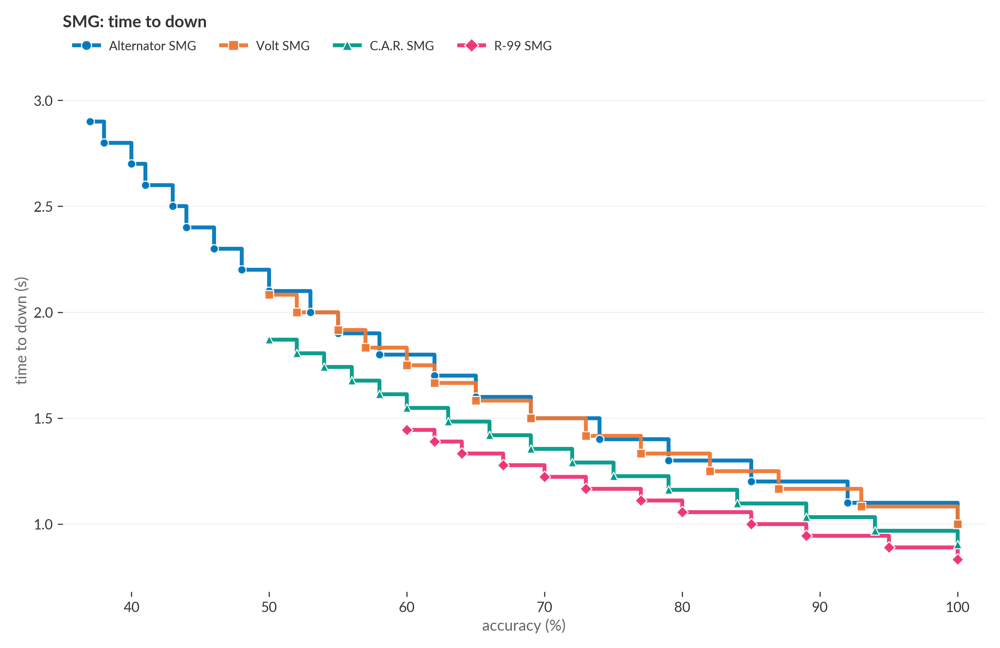

# Prediction: R-99 will become the S29 SMG meta

S29 launched today. The patch did not change R-99. C.A.R. returned to floor loot at 14 damage and 30 magazine. R-99 still leads the floor SMG class.

R-99 deals more damage per second than any other floor SMG. R-99's damage per second (DPS) is 234. C.A.R. is 217. Volt is 192. Alternator is 190. The DPS lead holds at any accuracy, not just at perfect aim.

R-99 has one weakness: it needs the highest accuracy to kill a 200 HP target in one magazine. R-99 needs 60%. C.A.R. and Volt need 50%. Alternator needs 37%. R-99 demands the most precision to one-clip.

R-99's DPS lead overrules the threshold weakness. I analyzed 21,884 R-99 firing bursts in ALGS data since the S24 patch. Pros reach 60% accuracy on 5% of them. Those bursts one-clip and deliver 11% of all R-99 damage. The other 95% fire below threshold and do not one-clip. R-99 still deals more damage per second there than C.A.R., Volt, or Alternator. R-99 has the highest DPS at every accuracy.

Two changes can bring R-99 in line. Option A: 12 damage, 30 magazine. R-99 drops to 216 DPS (equal to C.A.R.) and a 57% threshold. Option B: 11 damage, 38 magazine. R-99 drops to 198 DPS (equal to Volt) and a 50% threshold. Both options keep R-99 at 1080 rounds per minute. The trigger feel stays.

Until Respawn pairs a damage cut with a magazine bump, R-99 keeps the SMG meta.

Full analysis (math, methodology, empirical detail, assumptions) at [the long-form post](post.md).
